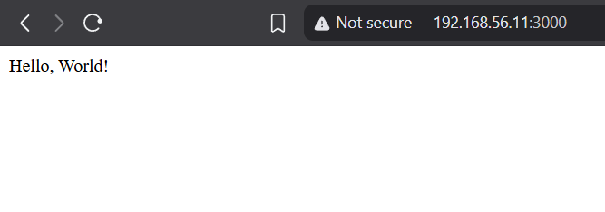

# Dockerized Node.js Web App
## Overview
This project demonstrates containerization by deploying a Node.js web app using Docker. The app serves a "Hello, World!" page and is hosted on Docker Hub.

## Tools Used
- Docker
- Node.js
- GitHub

## Setup Instructions
1. Clone the repo: `git clone https://github.com/[your-username]/Dockerized-NodeJS-WebApp`
2. Build the Docker image: `docker build -t my-app .`
3. Run the container: `docker run -p 3000:3000 my-app`
4. Access the app at `http://localhost:3000`

## Why Docker?
Docker ensures consistent environments across development and production, simplifying deployments.

## Screenshots

## What I Learned
- Creating and managing Docker images.
- Using Docker Hub for image storage.
